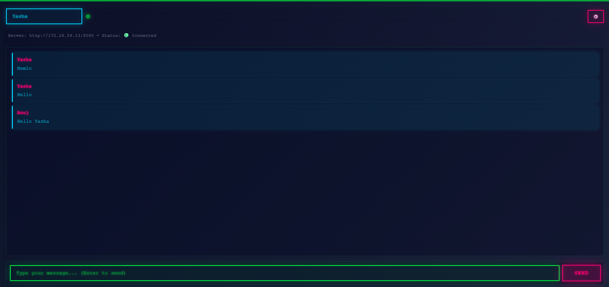
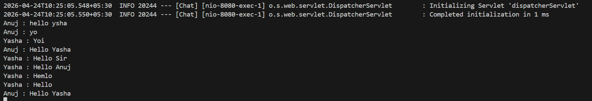

# Real-Time Chat Application

A full-stack real-time chat application built with Spring Boot WebSocket backend and React Vite frontend. This application enables users to communicate in real-time using WebSocket technology for instant message delivery.

## Project Overview

This experiment demonstrates the implementation of a real-time chat system using modern web technologies. The application uses WebSocket protocol for bidirectional communication between clients and server, ensuring low-latency message delivery.

## Features

- **Real-Time Messaging**: Instant message delivery using WebSocket protocol
- **Multiple Users**: Support for multiple concurrent users in the chat
- **Message Broadcasting**: Messages are broadcast to all connected clients
- **Responsive UI**: Clean and intuitive user interface built with React
- **STOMP Protocol**: Uses STOMP (Simple Text Oriented Messaging Protocol) for reliable messaging

## Technology Stack

### Backend
- **Framework**: Spring Boot 4.1.0-M4
- **Language**: Java 21
- **WebSocket**: Spring WebSocket with STOMP
- **Build Tool**: Maven
- **Database**: MySQL (configured)

### Frontend
- **Framework**: React with Vite
- **Build Tool**: Vite
- **Styling**: CSS
- **WebSocket Client**: SockJS with STOMP

## Project Structure

```
Experiment-10.1/
├── src/
│   ├── main/
│   │   ├── java/Websocket/Chat/
│   │   │   ├── ChatApplication.java          # Main Spring Boot application
│   │   │   ├── Config/
│   │   │   │   └── WebSocketConfig.java      # WebSocket configuration
│   │   │   ├── Controller/
│   │   │   │   └── ChatController.java       # Message handling controller
│   │   │   └── Model/
│   │   │       └── Message.java              # Message data model
│   │   └── resources/
│   │       └── application.properties        # Application configuration
│   └── test/
│       └── java/Websocket/Chat/
│           └── ChatApplicationTests.java
├── frontend/
│   ├── src/
│   │   ├── Components/
│   │   │   ├── App.jsx                       # Main React component
│   │   │   ├── Chat.jsx                      # Chat interface component
│   │   │   ├── MessageInput.jsx              # Message input component
│   │   │   └── MessageList.jsx               # Message display component
│   │   ├── App.css
│   │   ├── index.css
│   │   └── main.jsx
│   ├── package.json
│   └── vite.config.js
├── pom.xml                                    # Maven configuration
└── Readme.md
```

## Architecture

### Backend Architecture

1. **WebSocketConfig**: Configures STOMP endpoints and message broker
   - Endpoint: `/ws` for WebSocket connections
   - Application destination prefix: `/app`
   - Message broker topic: `/topic`

2. **ChatController**: Handles incoming messages and broadcasts them
   - Receives messages from clients
   - Processes and broadcasts to all subscribers

3. **Message Model**: Represents chat messages with sender and content

### Frontend Architecture

1. **App Component**: Main application wrapper
2. **Chat Component**: Core chat interface
3. **MessageInput Component**: Handles user input and message sending
4. **MessageList Component**: Displays received messages

## Getting Started

### Prerequisites
- Java 21 or higher
- Node.js and npm
- Maven
- MySQL (optional, for persistence)

### Backend Setup

1. Navigate to the project root directory
2. Configure MySQL connection in `src/main/resources/application.properties`
3. Build the project:
   ```bash
   mvn clean install
   ```
4. Run the application:
   ```bash
   mvn spring-boot:run
   ```
   The backend will start on `http://localhost:8080`

### Frontend Setup

1. Navigate to the frontend directory:
   ```bash
   cd frontend
   ```
2. Install dependencies:
   ```bash
   npm install
   ```
3. Start the development server:
   ```bash
   npm run dev
   ```
   The frontend will start on `http://localhost:5173`

## How It Works

1. **Connection**: Client connects to the WebSocket endpoint `/ws` using SockJS and STOMP
2. **Subscription**: Client subscribes to `/topic/messages` to receive messages
3. **Message Sending**: User sends a message to `/app/chat` endpoint
4. **Broadcasting**: Server receives the message and broadcasts it to all subscribers
5. **Display**: All connected clients receive and display the message in real-time

## Screenshots





## Configuration

### WebSocket Configuration

The WebSocket configuration in `WebSocketConfig.java` sets up:
- STOMP message broker for handling subscriptions
- Application destination prefix for routing client messages
- SockJS fallback for browsers without WebSocket support
- CORS configuration to allow connections from React frontend

## Future Enhancements

- User authentication and authorization
- Private messaging between users
- Message persistence in database
- User presence indicators
- Message history
- File sharing capabilities
- Typing indicators

## Notes

- The application uses SockJS with STOMP for reliable WebSocket communication
- CORS is configured to accept connections from any origin (suitable for development)
- The simple message broker is used for development; consider using RabbitMQ or ActiveMQ for production

## License

This project is part of the Full Stack Development curriculum (Semester 6).
