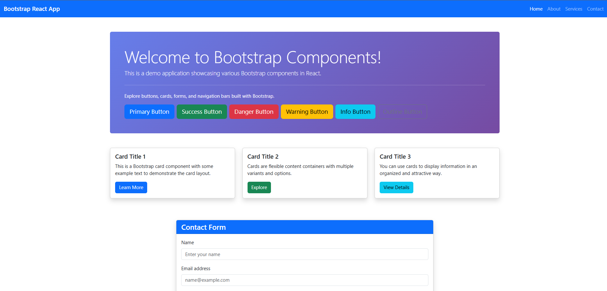
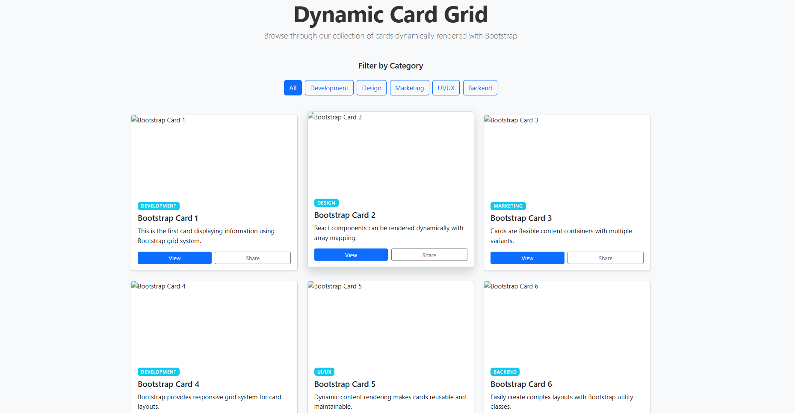
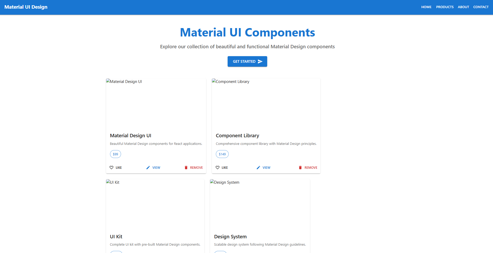
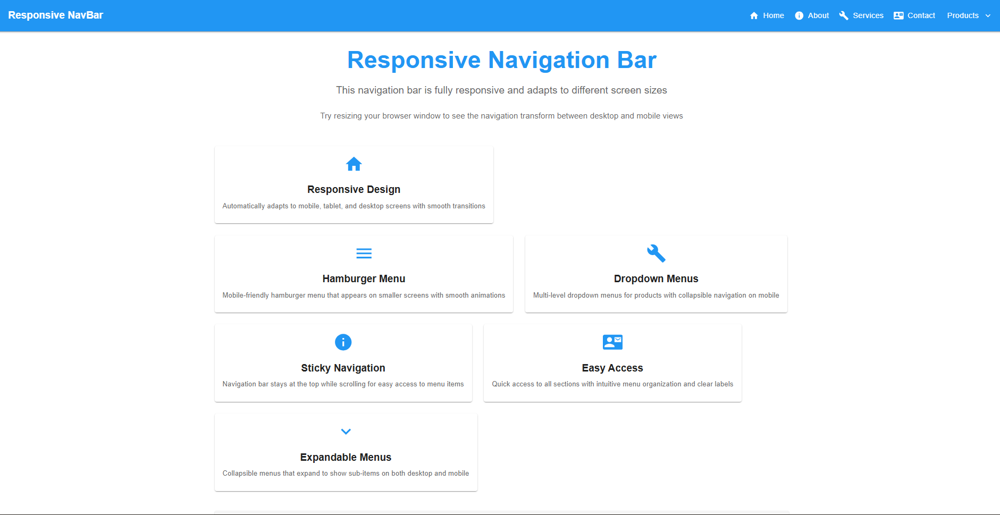

# Experiment 2: Full-Stack React Applications

### **exp-2.1: Basic React + Vite Setup**

**Purpose:** Foundation for React development  
**Tech Stack:** React 19, Vite  
**Key Features:**
- Minimal boilerplate for rapid prototyping
- Hot Module Replacement (HMR) for instant feedback
- Standard component structure with hooks
- ESLint configuration for code quality

### **exp-2.2: Material-UI & Component Library**

**Purpose:** Explore component libraries and design systems  
**Tech Stack:** React 19, Vite, Material-UI (@mui/material), Bootstrap  
**Key Features:**
- Pre-built Material Design components
- Responsive grid layouts
- Theme configuration and customization
- Icon libraries and typography system
- Form controls with validation states

### **exp-2.3: Advanced Routing & State Management**

**Purpose:** Explore client-side routing and state patterns  
**Tech Stack:** React 19, Vite, React Router v7, Custom hooks  
**Key Features:**
- Multi-page navigation with URL synchronization
- Route parameters and nested routes
- Protected routes and middleware patterns
- Form state management with hooks
- URL query parameter handling

### **exp-2.4: Production-Ready Architecture**

**Purpose:** Demonstrate scalable, maintainable React patterns  
**Tech Stack:** React 19, Vite, Material-UI, React Router, Custom hooks  
**Key Features:**
- Modular component architecture
- Service layer for API communication
- Custom hooks for shared logic
- Environment configuration
- Error boundaries and error handling
- Performance optimizations (lazy loading, code splitting)

