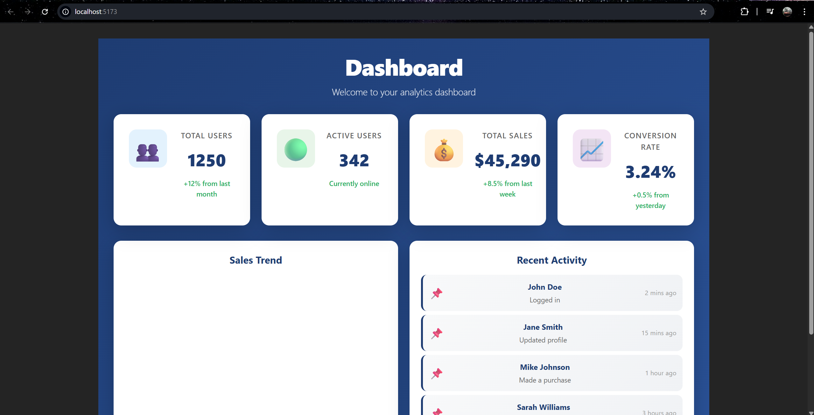

# Experiment 5.1: Analytics Dashboard

## Author
Yasha Tasaneem

## Aim
To create a responsive analytics dashboard that displays key metrics, sales trends, and recent user activity in a visually appealing interface.

## Features
- **Stats Cards**: Display key metrics (Total Users, Active Users, Total Sales, Conversion Rate)
- **Sales Trend Chart**: Bar chart showing sales data across 8 months (Jan-Aug)
- **Recent Activity**: List of recent user activities with timestamps
- **Responsive Design**: Dashboard fits the entire screen without blank spaces
- **Modern UI**: Gradient background, smooth animations, and hover effects
- **Lazy Loading**: Dashboard component is lazy loaded for better performance

## Dashboard Components

### Stats Container
- 4 stat cards displaying important metrics
- Each card shows an icon, metric name, value, and change percentage
- Hover effects with smooth animations

### Sales Trend Section
- Bar chart visualization of monthly sales data
- Interactive bars with hover effects
- Legend showing sales in dollars

### Recent Activity Section
- List of recent user activities
- Shows user name, action performed, and timestamp
- Scrollable list for multiple activities

## Technologies Used
- React with Hooks (useState)
- CSS3 with Flexbox and Grid
- Lazy loading with React.lazy and Suspense
- Gradient backgrounds and animations

## Styling Highlights
- Professional blue gradient background (#1e3c72 to #2a5298)
- Rounded corners (16px) for modern look
- Box shadows for depth
- Smooth transitions and hover animations
- Responsive grid layout

