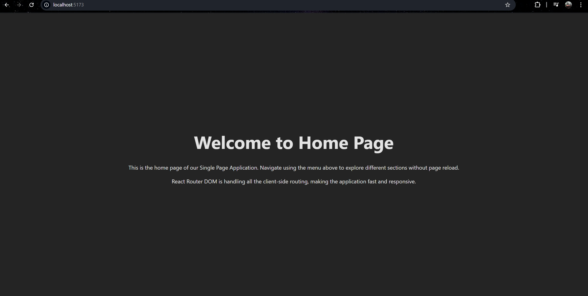
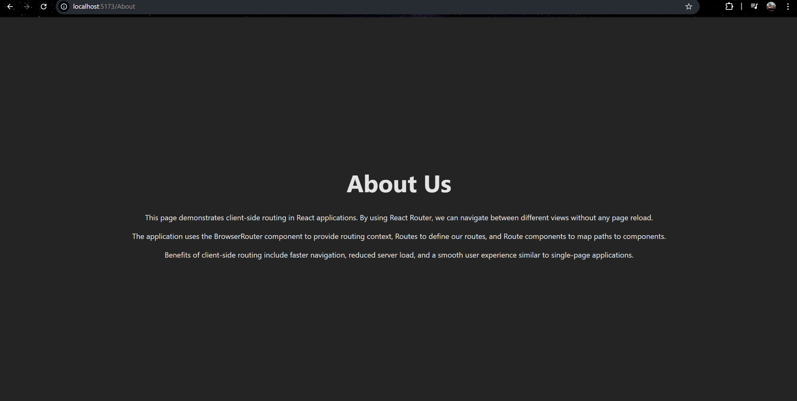

# Experiment 5.2: Multi-Page Website with Client-Side Routing

## Author
Yasha Tasaneem

## Aim
To create a multi-page website using React Router for client-side routing without page reloads.

## Features
- **Client-Side Routing**: Fast navigation between pages without server requests
- **Lazy Loading**: Components are lazy loaded for better performance
- **Home Page**: Welcome page with introduction to the SPA
- **About Page**: Information about client-side routing and React Router benefits
- **Services Page**: List of services with descriptions (Web Development, UI/UX Design, Backend Development, Mobile App Development)
- **Contact Page**: Contact form with name, email, and message fields
- **Navigation Menu**: Easy navigation between all pages
- **Form Handling**: Contact form with validation and success message
- **Responsive Design**: Works seamlessly on all devices

## Pages Included

### Home
- Landing page introducing the SPA
- Explains client-side routing benefits

### About
- Details about React Router implementation
- Explains BrowserRouter, Routes, and Route components
- Benefits of client-side routing

### Services
- Displays 4 services with descriptions:
  - Web Development
  - UI/UX Design
  - Backend Development
  - Mobile App Development
- Styled service cards with left border accent

### Contact
- Contact form with fields: Name, Email, Message
- Form validation
- Success message on submission
- Auto-reset after 2 seconds

## Technologies Used
- React with Hooks (useState)
- React Router DOM for routing
- CSS3 for styling
- Vite as build tool

## Project Structure
```
src/
├── components/
│   ├── Home.jsx
│   ├── About.jsx
│   ├── Services.jsx
│   └── Contact.jsx
├── App.jsx
├── App.css
└── main.jsx
```



