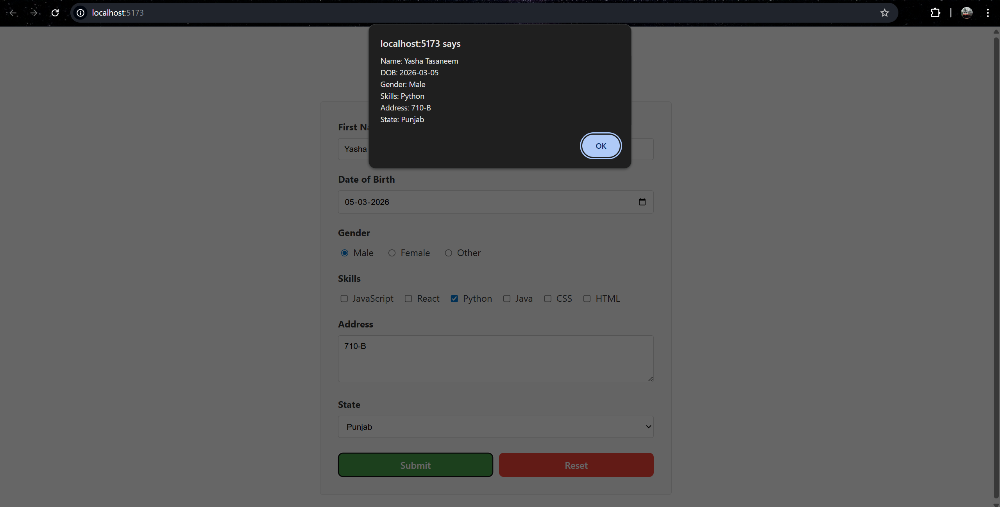

# Experiment 6.1: User Registration Form

## Aim
To create a comprehensive user registration form with client-side validation and alert-based submission.

## Features
- First Name and Last Name input fields
- Date of Birth with past date restriction
- Gender selection (Male, Female, Other)
- Skills selection with checkboxes (JavaScript, React, Python, Java, CSS, HTML)
- Address textarea
- State dropdown with Indian states
- Form validation before submission
- Alert popup displaying submitted data
- Form reset functionality

## Validation Rules
- First Name: Required
- Last Name: Required
- Date of Birth: Required, no future dates allowed
- Gender: Required
- Skills: At least one skill must be selected
- Address: Required
- State: Required

## Form Submission
Upon successful validation, all form data is displayed in an alert popup with the following format:
- Name
- Date of Birth
- Gender
- Skills
- Address
- State

The form automatically resets after submission.

