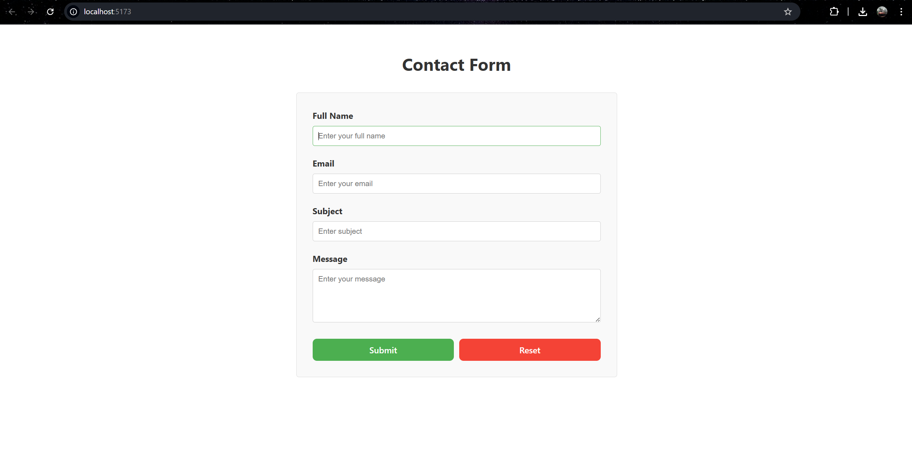

# Experiment 6.1: Handling Forms Using Controlled Components

## Aim
To create and handle forms in React using controlled components.

## Theory
Controlled components are React components where form data is managed by React state. This provides complete control over user input.

## Features
- Text input fields
- Textarea for messages  
- Form submission
- Form reset
- Error validation
- Submitted data display

