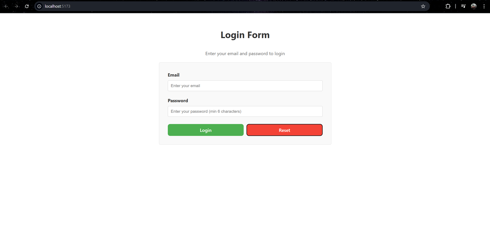
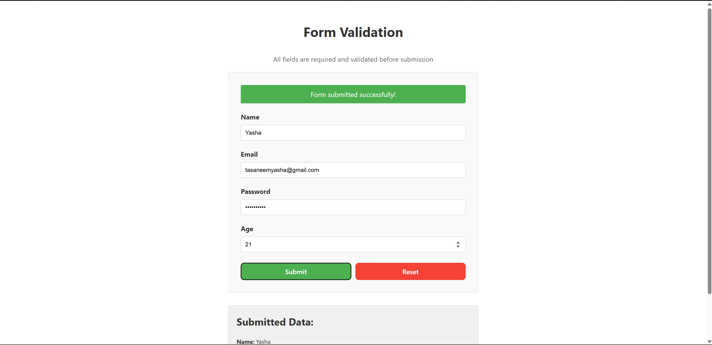
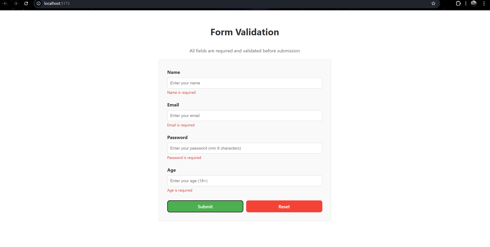

# Experiment 6.2: Client-Side Form Validation

## Aim
To validate form inputs on the client side before submission.

## Theory
Client-side validation checks user input and provides immediate feedback without server interaction. This improves user experience.

## Features
- Form validation before submission
- Error messages for invalid input
- Submit button enabled only when form is valid
- Form reset functionality
- Clean and simple UI

## Validation Rules
- **Name**: Min 3 characters
- **Email**: Valid email format
- **Password**: Min 6 characters
- **Age**: Must be 18 or older

